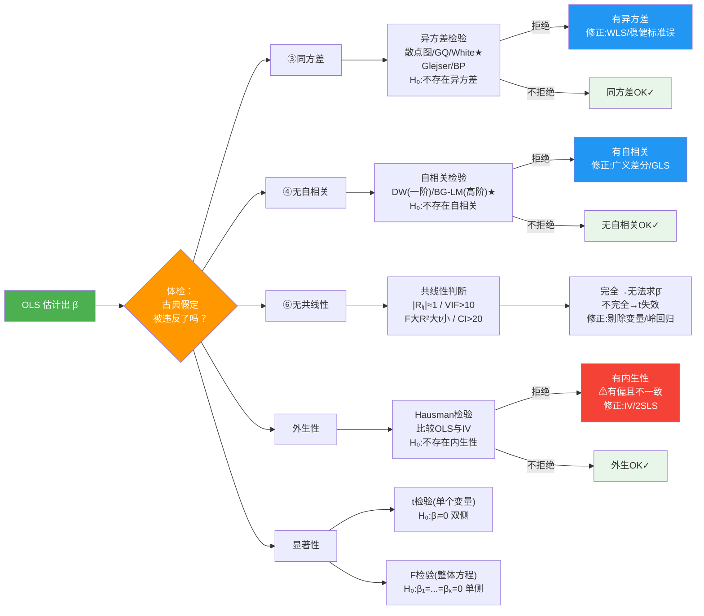
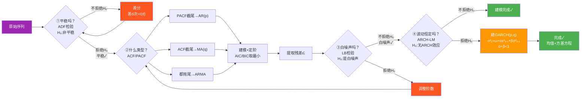
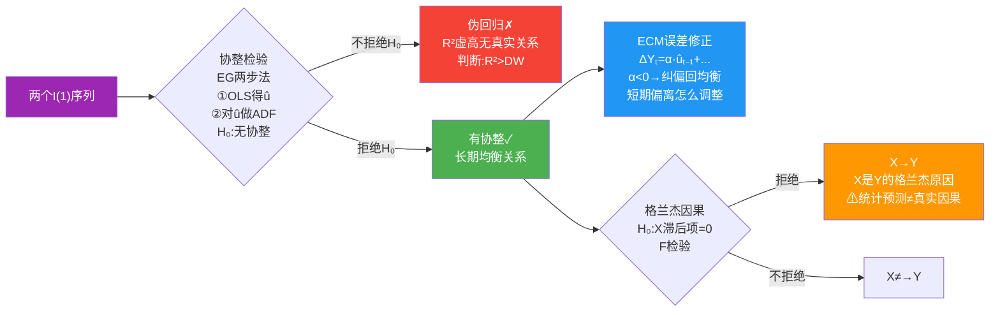
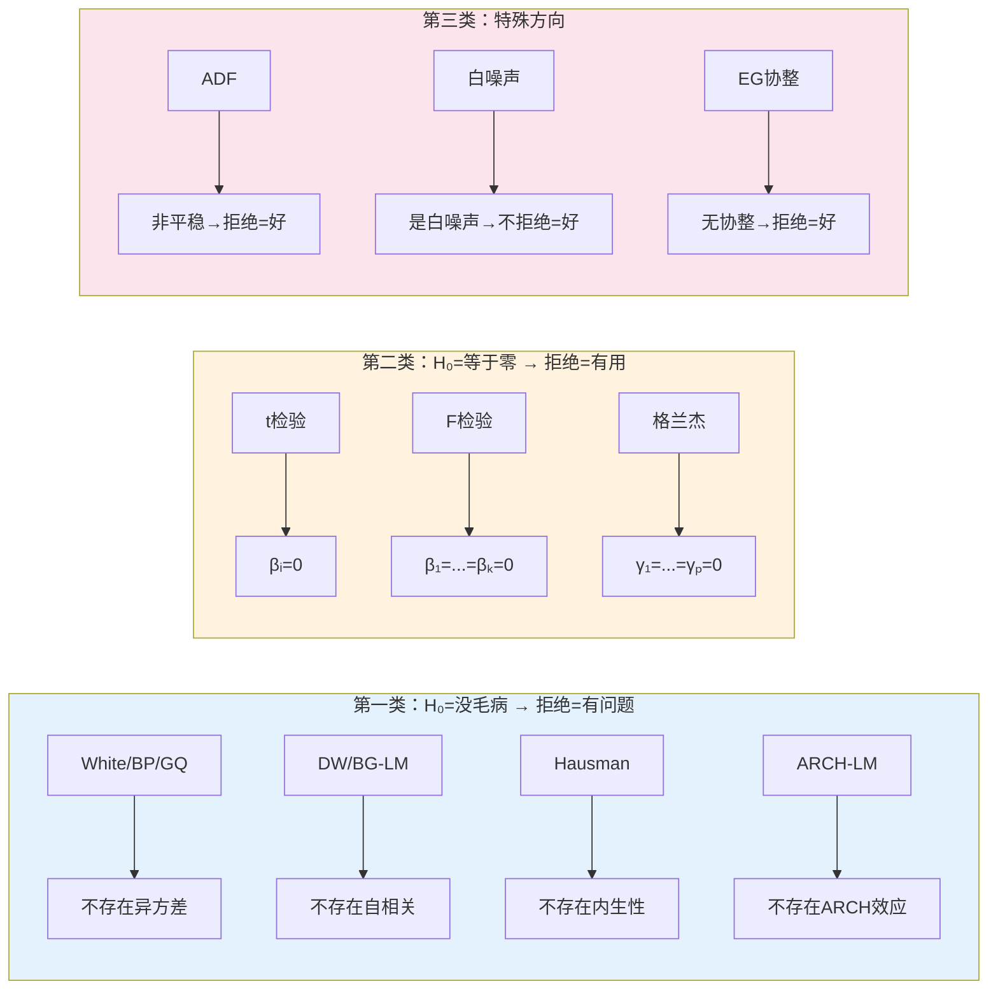

# 金融计量学 · 知识结构图（Mermaid）

> 直接复制到 Obsidian 笔记里，用 ```mermaid 代码块包裹即可渲染。
> 每条线一张图，从左到右展开，方便横向阅读。

---

## 第一条线：OLS 基础——古典假定体检


```mermaid
flowchart LR
    OLS["OLS 估计出 β̂"] --> CHECK{"体检：<br/>古典假定<br/>被违反了吗？"}
    
    CHECK --> HET["③同方差"]
    CHECK --> AC["④无自相关"]
    CHECK --> MC["⑥无共线性"]
    CHECK --> ENDO["外生性"]
    CHECK --> SIG["显著性"]

    HET --> HET_TEST["异方差检验<br/>散点图/GQ/White★<br/>Glejser/BP<br/>H₀:不存在异方差"]
    HET_TEST -->|拒绝| HET_FIX["有异方差<br/>修正:WLS/稳健标准误"]
    HET_TEST -->|不拒绝| HET_OK["同方差OK✓"]

    AC --> AC_TEST["自相关检验<br/>DW(一阶)/BG-LM(高阶)★<br/>H₀:不存在自相关"]
    AC_TEST -->|拒绝| AC_FIX["有自相关<br/>修正:广义差分/GLS"]
    AC_TEST -->|不拒绝| AC_OK["无自相关OK✓"]

    MC --> MC_TEST["共线性判断<br/>|Rᵢⱼ|≈1 / VIF>10<br/>F大R²大t小 / CI>20"]
    MC_TEST --> MC_R["完全→无法求β̂<br/>不完全→t失效<br/>修正:剔除变量/岭回归"]

    ENDO --> ENDO_TEST["Hausman检验<br/>比较OLS与IV<br/>H₀:不存在内生性"]
    ENDO_TEST -->|拒绝| ENDO_FIX["有内生性<br/>⚠有偏且不一致<br/>修正:IV/2SLS"]
    ENDO_TEST -->|不拒绝| ENDO_OK["外生OK✓"]

    SIG --> T["t检验(单个变量)<br/>H₀:βᵢ=0 双侧"]
    SIG --> F["F检验(整体方程)<br/>H₀:β₁=...=βₖ=0 单侧"]

    style OLS fill:#4CAF50,color:#fff
    style CHECK fill:#FF9800,color:#fff
    style HET_FIX fill:#2196F3,color:#fff
    style AC_FIX fill:#2196F3,color:#fff
    style ENDO_FIX fill:#F44336,color:#fff
    style HET_OK fill:#E8F5E9
    style AC_OK fill:#E8F5E9
    style ENDO_OK fill:#E8F5E9
```

---

## 第二条线：时间序列建模流程


```mermaid
flowchart LR
    RAW["原始序列"] --> STAT{"①平稳吗？<br/>ADF检验<br/>H₀:非平稳"}
    
    STAT -->|不拒绝H₀| DIFF["差分<br/>差d次=I(d)"]
    DIFF --> STAT
    STAT -->|拒绝H₀<br/>平稳✓| IDENT{"②什么类型？<br/>ACF/PACF"}

    IDENT --> AR["PACF截尾→AR(p)"]
    IDENT --> MA["ACF截尾→MA(q)"]
    IDENT --> ARMA["都拖尾→ARMA"]

    AR --> MODEL["建模+定阶<br/>AIC/BIC取最小"]
    MA --> MODEL
    ARMA --> MODEL

    MODEL --> RESID["提取残差ε̂ₜ"]
    
    RESID --> WN{"③白噪声吗？<br/>LB检验<br/>H₀:是白噪声"}
    
    WN -->|不拒绝H₀<br/>白噪声✓| ARCH{"④波动恒定吗？<br/>ARCH-LM<br/>H₀:无ARCH效应"}
    WN -->|拒绝H₀| ADJ["调整阶数"]
    ADJ --> IDENT

    ARCH -->|不拒绝H₀| DONE["建模完成✓"]
    ARCH -->|拒绝H₀| GARCH["建GARCH(p,q)<br/>σ²ₜ=ω+αε²ₜ₋₁+βσ²ₜ₋₁<br/>α+β<1"]
    GARCH --> DONE2["完成✓<br/>均值+方差方程"]

    style RAW fill:#9C27B0,color:#fff
    style DONE fill:#4CAF50,color:#fff
    style DONE2 fill:#4CAF50,color:#fff
    style DIFF fill:#FF5722,color:#fff
    style ADJ fill:#FF5722,color:#fff
    style GARCH fill:#FF9800,color:#fff
```

---

## 第三条线：多序列拓展


```mermaid
flowchart LR
    TWO["两个I(1)序列"] --> EG{"协整检验<br/>EG两步法<br/>①OLS得û<br/>②对û做ADF<br/>H₀:无协整"}
    
    EG -->|不拒绝H₀| FAKE["伪回归✗<br/>R²虚高无真实关系<br/>判断:R²>DW"]
    
    EG -->|拒绝H₀| COINT["有协整✓<br/>长期均衡关系"]
    
    COINT --> ECM["ECM误差修正<br/>ΔYₜ=α·ûₜ₋₁+...<br/>α<0→纠偏回均衡<br/>短期偏离怎么调整"]
    
    COINT --> GR{"格兰杰因果<br/>H₀:X滞后项=0<br/>F检验"}
    
    GR -->|拒绝| YES["X→Y<br/>X是Y的格兰杰原因<br/>⚠统计预测≠真实因果"]
    GR -->|不拒绝| NO["X≠→Y"]

    style TWO fill:#9C27B0,color:#fff
    style COINT fill:#4CAF50,color:#fff
    style FAKE fill:#F44336,color:#fff
    style ECM fill:#2196F3,color:#fff
    style YES fill:#FF9800,color:#fff
```

---

## 附：H₀ 方向速查


```mermaid
flowchart LR
    subgraph A["第一类：H₀=没毛病 → 拒绝=有问题"]
        W["White/BP/GQ"] --> W0["不存在异方差"]
        DW["DW/BG-LM"] --> DW0["不存在自相关"]
        HA["Hausman"] --> HA0["不存在内生性"]
        AL["ARCH-LM"] --> AL0["不存在ARCH效应"]
    end

    subgraph B["第二类：H₀=等于零 → 拒绝=有用"]
        TT["t检验"] --> T0["βᵢ=0"]
        FF["F检验"] --> F0["β₁=...=βₖ=0"]
        GG["格兰杰"] --> G0["γ₁=...=γₚ=0"]
    end

    subgraph C["第三类：特殊方向"]
        AD["ADF"] --> AD0["非平稳→拒绝=好"]
        LB["白噪声"] --> LB0["是白噪声→不拒绝=好"]
        EE["EG协整"] --> EE0["无协整→拒绝=好"]
    end

    style A fill:#E3F2FD
    style B fill:#FFF3E0
    style C fill:#FCE4EC
```
